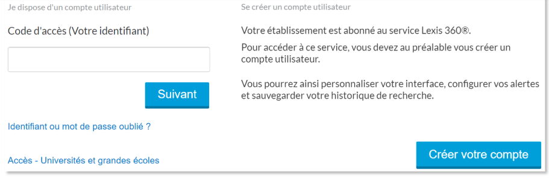

# Introduction et objectifs de la formation (5 min)

## Modalités
Cette formation durera deux heures, en salle 5. Vous pouvez prendre les notes si vous le souhaitez, un le fil de la formation sera disponible dans le Commun KB.
Pour cette formation tout le monde doit avoir son propre PC et un accès à internet.
La formation est filée, mais il s'agit avant tout que vous gagniez en aisance dans le cadre de votre métier. On essaiera donc au plus de rester dans une dynamique d'échange, et d'entraînement, même si, je n'ai pas le choix d'ouvrir la formation avec un peu de magistral.

## Programme
1. On commence avec les bases absolues, la logique documentaire. Ce sera le moment magistral de la formation. C'est le socle de ce qu'on va pratiquer après. (30minutes)
2. Un peu de méthodologie pour la suite avec le traitement des demandes, que retenir d'une demande, comment la problématiser rapidement et la transformer en une question que nous, bibliothécaire, pouvons comprendre (20 minutes)
3. On ira ensuite s'entraîner dans un certain nombre d'outils : Focus, PubMed, LiSSa en priorité, et, si nous avons le temps, des outils plus spécifiques EM Paramédical, la Cochrane.
A chaque étape de ce programme, n'hésitez pas à poser des questions, à faire part de votre expérience, c'est avant tout pour ça qu'on est là. Si le programme n'est pas respecté, ce n'est absolument pas grave (bien au contraire, cela signifiera que nous avons discuté, et c'est le but).

## Objectifs
- Formation d'adaptation au poste. Vous avez été et vous serez confrontés à des demandes de renseignement documentaire parfois complexe. Vous devez être en capacité d'y répondre avec efficacité et pertinence.
- Vous mettre à l'aise avec un certain type de raisonnement, pas compliqué mais assez fondamental désormais, quel que soit votre métier et votre évolution future.
- Pan de votre culture professionnelle.
- Répondre à vos questions et échanger sur vos expériences (réfléchissez à des questions pour la semaine prochaine !).

## Compétences visées
A l'issue de cette formation vous saurez :
- Problématiser votre besoin en information pour séquencer le processus de recherche documentaire ;
- Elaborer des stratégies de recherche simples à intermédiaires (intersection de deux sous-ensembles ou plus) en utilisant des mots-clés articulés dans une équation booléenne ;
- Intégrer les outils de recherche propres à votre environnement disciplinaire et métier
**Niv. Recherché** : Initiation avancée à débutant intermédiaire

# Traiter une demande (20 min)
Vous partez d’un sujet, plus ou moins bien formulé. 
La **première étape** est toute bête, il faut identifier les termes qui vous semblent fondamentaux, les **termes significatifs.**
La **seconde étape** consiste à articuler ces termes, et donc à les classer en grandes thématiques pour déterminer l’**extension maximale** de votre sujet, ou, autrement dit, la limite de généralisation au-delà de laquelle vous êtes hors-sujet.

## Identifier les ![[Termes significatifs]]
### Activité sur Wooclap
- Q1 : Pointer sur l'image
- Q2 : Nuage de mots
- Q3 : Question ouverte

## Délimiter l'![[Extension maximale]]
### Activité sur Wooclap
- Q4 : Selon vous, quelles sont les grandes thématiques de ce sujet ?
- Q5 : Selon vous, quelles sont les grandes thématiques de ce sujet ?

> Dans le cadre d'une demande de renseignement rapide en bureau d'accueil pour par mail, l'identification des termes significatifs suffit, et c'est d'ailleurs ce que vous faîtes automatiquement.
> La détermination de l'extension maximale est plutôt pertinente lors de formations plus longues. L'idée est de s'aider à problématiser la demande, de trouver un point de débat, un espace de confrontation entre plusieurs thématiques (le patient vs. le médecine traitant ; la vaccination vs. la personne enceinte, etc.) Ce besoin de problématiser va se faire sentir dans des demandes plus abouties, dans le cadre d'un travail de recherche.

# La logique documentaire (30 min)
## Le fonctionnement des opérateurs de recherche
### ![[AND]]
### ![[OR]]
### ![[NOT]]
## L'usage des parenthèses
### Quelques exemples et contre-exemples ![[Elements/Logique de la recherche documentaire/Nesting]]
### La ![[Distributivité]] en logique documentaire
## Les astuces de base
### La ![[Troncature]]
### Les ![[Guillemets]]

> Il s'agit de la base absolue de la recherche documentaire, si vous maîtrisez ça, vous pouvez vous en sortir partout, autant dans Focus que dans une base de donnée bibliographique plus complexe ou un métamoteur.
> Dans la suite de la formation, on va tout simplement s'entraîner dans différents outils, en priorité ceux que vous êtes le plus susceptibles d'utiliser, c'est-à-dire **Focus**, **PubMed**, **LiSSa**, mais gardez en tête que ce que vous allez maîtriser maintenant est le fonctionnement de base de la plupart des outils de recherche numérique dans le monde.

### Activité sur Wooclap
Q6 : Parmis ces requêtes lesquelles sont bien formées ?

# Entraînement (1h-1h05)
Nous allons nous entraîner à la fois sur Wooclap, sur vos PCs et sur tableau blanc au besoin.

## Exercice 1 : ![[Focus page de résultats]]
Une étudiante en IFSI vous demande tous les ouvrages en ligne que l'on peut lui proposer autour de la notion de **"refus de soin"**.
1. quelle requête envoyez-vous à Focus ?
	- "refus de soin"
1. combien de résultats obtenez-vous ?
	- 206
2. que faire pour réduire ce nombre et ne faire remonter que les ouvrages en ligne ?
	- filtrer par type de ressource
		- cocher les **chapitres de livre** et les **livres**
3. Combien d'ouvrages pouvez-vous lui proposer ?
	- 4 ouvrages en ligne

## Exercice 2 : ![[Focus page de résultats]]
Un étudiant en IFSI (encore) vous demande des conseils de lecture pour son mémoire sur **l'impact du bruit à l'hôpital**.
1. quels sont les termes que vous sélectionnez pour votre requête?
	- bruit, hôpital (impact est à éviter)
2. quelle requête envoyez-vous ?
	- bruit hôpital / bruit ET hôpital / bruit AND hôpital
3. combien de résultats obtenez-vous ?
	- 106
4. discussion autour de ce que l'on peut faire pour essayer de faire remonter le plus possible de références pertinente
	1. question de l'ambiguité du terme "bruit"
	2. généralité de sujet "hôpital" qu'il faudrait préciser. De quel bruit parle-t-on ? Du bruit des appareil ? Du bruit du personnel ? Du bruit des patients ?
	3. L'impact du bruit sur qui ? Sur les patients ? Sur les personnels soignants ?
Pour développer cette question, on peut aboutir à une requête de ce genre : **(bruit OU "pollution sonore" OU "nuisance sonore" OU "niveau sonore") ET (personnel* OU soignant* OU hôpital OU hospitalier)**

## Exercice 3 : ![[Pubmed Basic]] et ![[Sudoc]]
Une interne commence à faire quelques recherches pour sa thèse d'exercice sur la **perception qu'on les patients des risques cardio-vasculaires**. Elle a déjà fouillé Google Scholar mais elle aurait besoin d'aide pour trouver des **thèses d'exercice déjà soutenues** ainsi que quelques **références d'articles**.
Par quoi commence-t-on ?
1. Délimiter la demande. On a :
	- un sujet
	- deux types de ressources à trouver
2. Pour chercher des références de thèses d'exercice sur le sujet, go **Sudoc**
	- On peut passer par la **recherche simple** pour un tour d'horizon
	- Se poser la question du champ de notice à interroger (ici "Mots du titre" conseillé)
	- Requête assez simple : **risque cardio-vasculaire perception** (on garde les termes en français)
	- 13 résultats (combien de thèses ?)
3. Pour chercher des références d'articles, go **PubMed** 
	- PubMed s'interroge uniquement en anglais il faut donc traduire les termes (HeTOP par exemple, ou DeepL)
	- Les termes :
		- *cardiovascular risk
		- *cardiovascular diseases
		- *risk
		- *risk assessment*
	- Une première recherche simple : **"risk assessment" AND "cardiovascular risk"**
	- On se retrouve avec plus de 9000 résultats mais on peut être plus précis en passant plus de temps
		- L'interne ne veut pas de références plus anciennes que 2017.
		- L'interne veut savoir quelle est l'essai clinique la plus récente sur ce sujet
		- L'interne veut exclure les enfants de moins de 12 ans

## Exercice 4 : ![[LiSSa Recherche Avancée]] et ![[Focus page de résultats]]
1. Travaillons sur le sujet de Nico : **Quel est l’impact de la kinésithérapie sur la qualité de vie des patientes ayant un lymphoedème secondaire au cancer du sein ?**

2. Des étudiants en IFSI se sont regroupés pour faire une demande globale de renseignement. Toutes et tous travaillent sur la notion de la douleur, mais selon des angles différents :
	- *La douleur et la communication*
	- *La douleur et la confiance du patient envers le soignant
	- *La posture du soignant face à la douleur du patient
	- *L'histoire de la douleur et de sa prise en charge

Avec autant d'angles, quelles sont vos propositions pour répondre du mieux que vous pouvez sans vous retrouver submergé ?
1. quelles sont nos références à la BU pour commencer ?
	- Faire une recherche sur Focus, combien de recherches ? On peut faire autant de recherche qu'il y a d'angles, ou on peut tenter une requête plus globale de ce type : **douleur ET (communication OU confiance OU "posture soignante" OU histoire OU "prise en charge")** avec un filtrage sur KB et sur les livres pour exclure les thèses et en ne prenant que les ouvrages les plus récent (par exemple 2017) : 18 résultats faciles à regarder.
2. pour des références d'articles en français, s'aider de la recherche avancée LiSSa pour utiliser des mots-clés (avec les propositions du site pour nous guider)
	- *douleur*
	- *perception de la douleur*
	- *mesure de la douleur*
	- *communication*
	- *infirmières et infirmiers*
	- *rôle professionnel*
	- ...

## Exercice 5 : ![[PubMed Advanced Search Builder]]
Exemple d'un sujet de thèse d'exercice en rendez-vous bibliographique :
> *La prise en charge de l'asthme non sévère en cabinet de médecine générale*

Pour utiliser le PASB, il faut impérativement passer en anglais. Mots-clés en anglais pour aider
- *asthma*
	- *non severe asthma*
- *general practice*
	- *family practice*
- *general practitionners*

1. Construire une requête en cherchant dans le mots du titre et de l'abstract : **("non severe asthma"[Title/Abstract] OR asthma[tiab]) AND ("general practice"[Title/Abstract] OR "family practice"[Title/Abstract] OR "family medicine"[Title/Abstract])**
